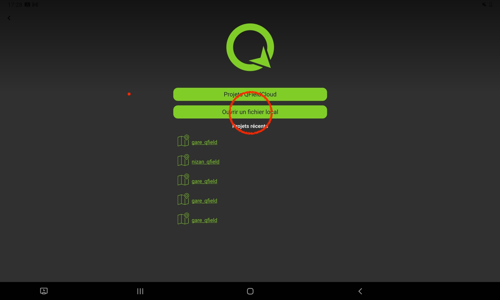
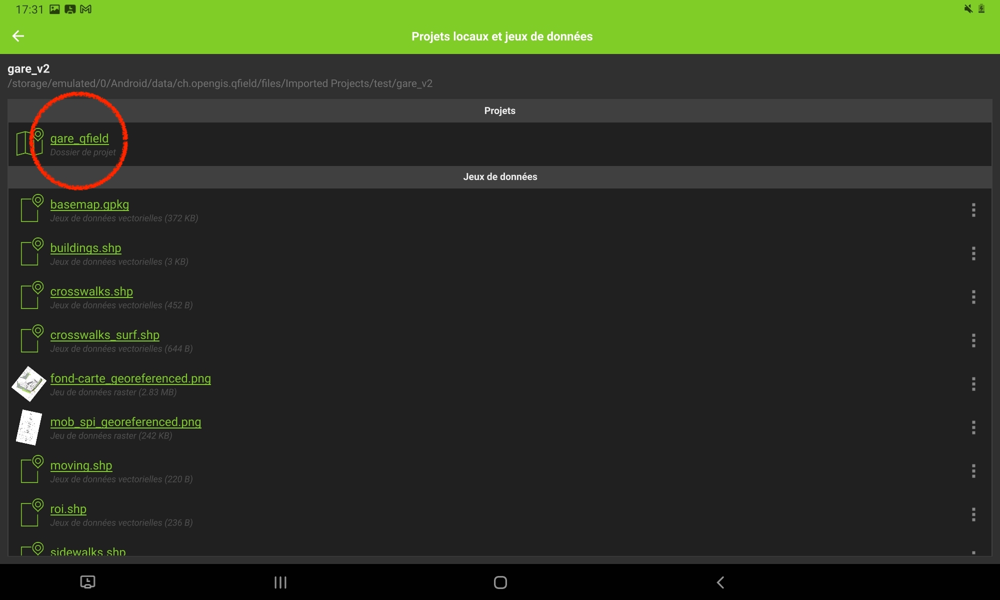
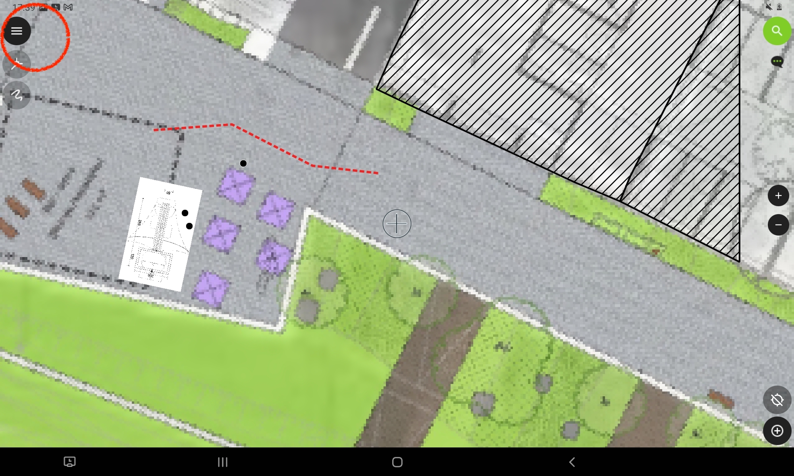
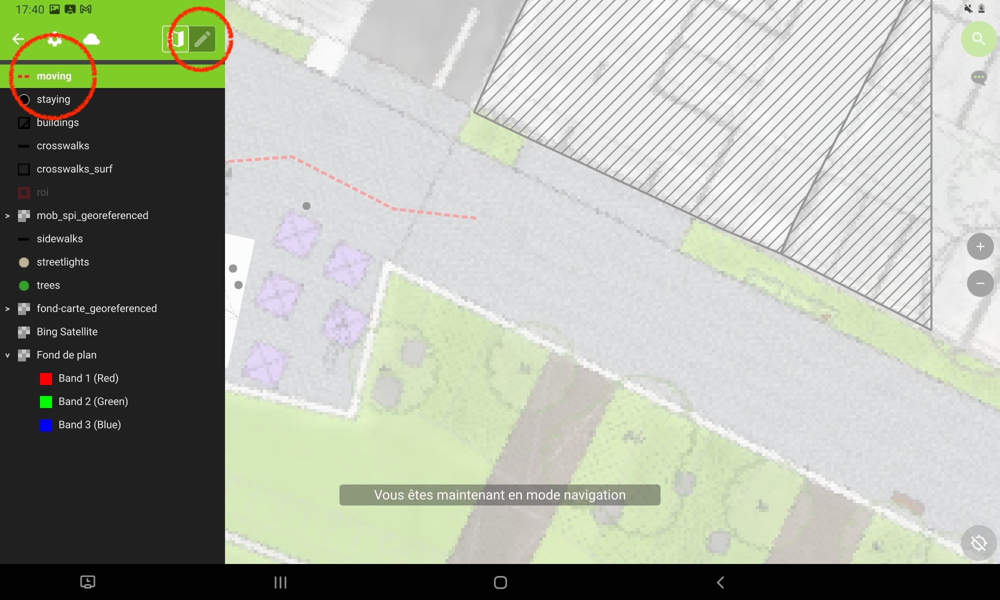
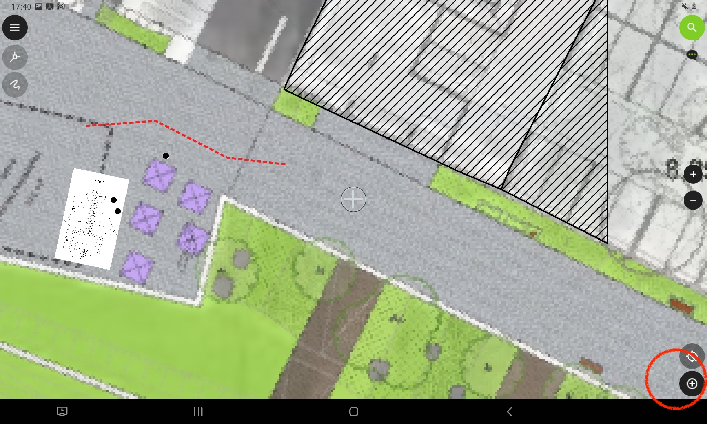
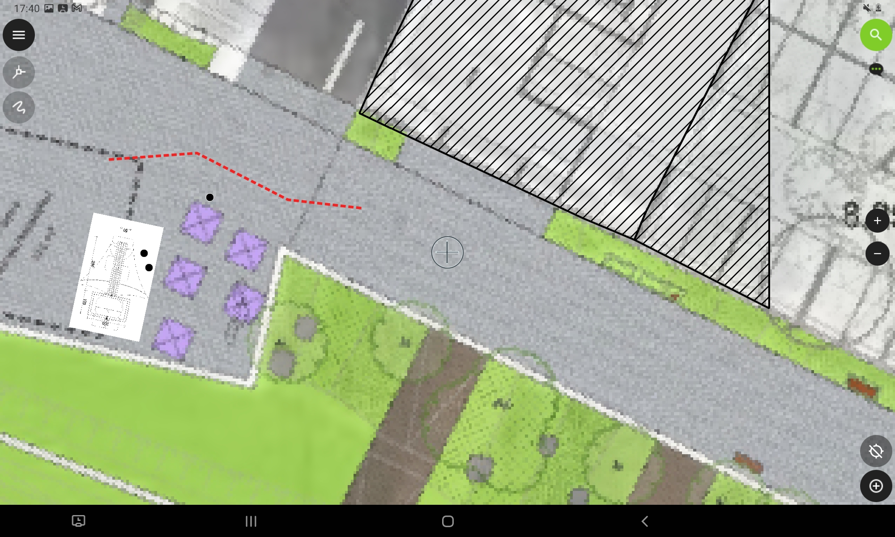
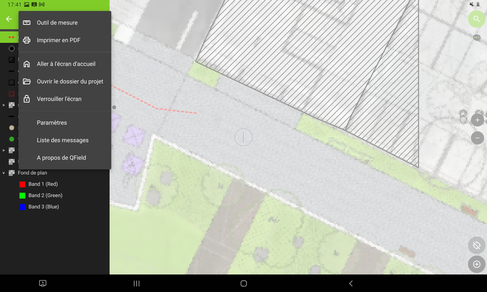
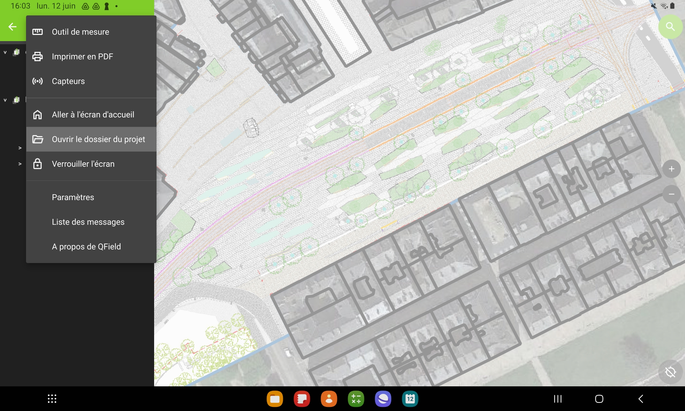
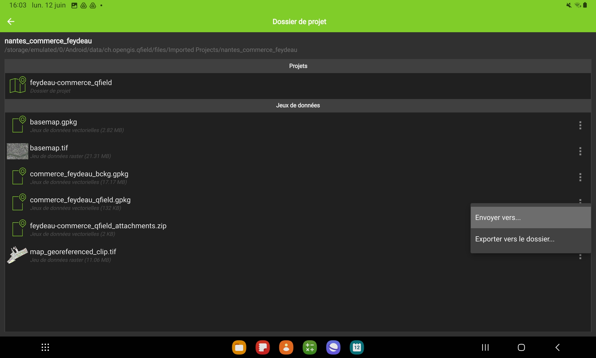
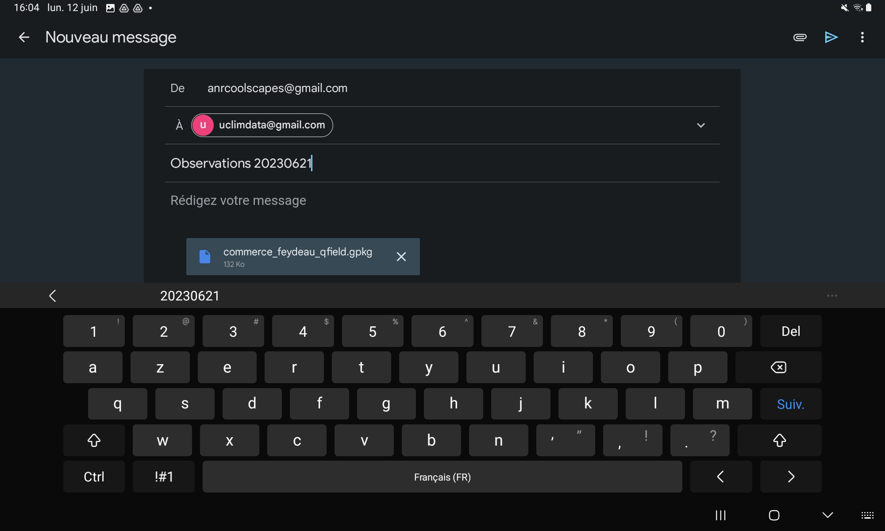

# Manuel d’utilisation de QField pour une observation de terrain

## Lancer le projet d’observation
- Démarrer l’application en appuyant l’icône QField sur la tablette et appuyer
- Sélectionner «Ouvrir un fichier local»

- Chercher dans le dossier «Projets importés» le dossier correspondant au site, date et heure de l’observation. Les noms des fichiers sont organisés comme suit : site_date_heure (format : texte_YYYYMMDD_HHMM)
    1. Site : il s’agit du nom du site d’observation écrit en minuscules
    2. Date : il s’agit de la date sur format année (Y), mois (M) et jour (D) sans espaces
    3. Heure : il s’agit de l’heure de démarrage de l’observation prévue sur format heure (H) et minutes (M)
  - Sélectionner le projet correspondant au nom du dossier précédent qu’apparaît sous la barre «Projets»

## Sélectionner le calque pour l’observation

- Vérifier à l’ouverture qu’aucune entité apparaît dessinée pour éviter d’écraser les données.
- Sélectionner le calque correspondant à l’heure d’observation

## Noter une situation statique
- Pour la 1re annotation de chaque observation :
    - Appuyer sur le bouton options en noir avec trois lignes dans l’angle supérieur gauche de l’écran.
    - Activer le mode édition en appuyant sur le bouton avec un stylo dans la bande supérieure verte.

- Sélectionner le calque «staying»
- Situer la cible située sur le centre de l’écran de la manière la plus précise sur localisation de la cellule observée
- Appuyer sur le bouton vert dans l’angle inférieur droit avec un symbole +

- L’onglet d’attributs du point s’ouvre automatiquement. Renseigner les attributs de l’observation selon les champs suivant :
    - **id** attributs d’identification
        - timestamp : ne pas remplir, il s’inscrit automatiquement à l’heure d’introduction du point
        - X_lb93 et Y_lb93 : coordonnées en CRS Lambert 93
    - **gender** attribut du genre perçu par l’observateur
        - gender_male : glisser la barre pour indiquer le nombre d’hommes présents dans la cellule observée
        - gender_female : glisser la barre pour indiquer le nombre de femmes présents dans la cellule observée
    - **âge** attribut d’âge perçu par l’observateur
        - age_0-7 : glisser la barre pour indiquer le nombre d’hommes présents dans la cellule observée
        - age_8-17 : glisser la barre pour indiquer le nombre d’hommes présents dans la cellule observée
        - age_18-34 : glisser la barre pour indiquer le nombre d’hommes présents dans la cellule observée
        - age_35-50 : glisser la barre pour indiquer le nombre d’hommes présents dans la cellule observée
        - age_51-64 : glisser la barre pour indiquer le nombre d’hommes présents dans la cellule observée
        - age_65 : glisser la barre pour indiquer le nombre d’hommes présents dans la cellule observée
   - **situation**
       - activity : ouvrir la liste d’activités organisée comme suit : categorie-principale_categorie-secondaire ; par exemple cultural_observing
       - stay-time : ouvrir la liste et choisir en fonction du temps sur place observé
       - exposure : ouvrir la liste et choisir en fonction du niveau d’exposition au soleil perçu
       - clothing : ouvrir la liste et choisir en fonction du niveau d’habillement perçu 
       - posture : ouvrir la liste et choisir en fonction de la posture
       - interaction : ouvrir la liste et choisir en fonction de l’interaction avec les dispositifs étudiés
       - comments : ajouter des commentaires supplémentaires si nécessaire
- Appuyer sur le bouton de confirmation (V) dans l’angle supérieur gauche de la barre verte

## Noter une cellule en déplacement
- Pour la 1re annotation de chaque observation :
    - Appuyer sur le bouton options en noir avec trois lignes dans l’angle supérieur gauche de l’écran.
    - Activer le mode édition en appuyant sur le bouton avec un stylo dans la bande supérieure verte.

- Sélectionner le calque «moving»
- Dessiner la trajectoire de déplacement sous forme de polyligne en insérant autant de points intermédiaires que nécessaire.
    - Chaque point doit être créé en plaçant la cible située sur le centre de l’écran de la manière la plus précise sur localisation de la cellule observée et appuyant sur le bouton vert dans l’angle inférieur droit avec un symbole +. 
    - Si un point est introduit par erreur, il est possible de l’effacer en appuyant le bouton noir avec le symbole (-)
    - Une fois la polyligne finie, appuyer le bouton vert (V) pour les suivants.

- L’onglet d’attributs du point s’ouvre automatiquement. Renseigner les attributs de l’observation selon les champs suivant :
    - **id** attributs d’identification
        - timestamp : (champs calculé automatiquement, ne pas toucher) il s’inscrit automatiquement à l’heure d’introduction du point
        - direction : (champs calculé automatiquement, ne pas toucher)
    - **gender** attribut du genre perçu par l’observateur
        - gender_male : glisser la barre pour indiquer le nombre d’hommes présents dans la cellule observée
        - gender_female : glisser la barre pour indiquer le nombre de femmes présents dans la cellule observée
    - **âge** attribut d’âge perçu par l’observateur
        - age_0-7 : glisser la barre pour indiquer le nombre d’hommes présents dans la cellule observée
        - age_8-17 : glisser la barre pour indiquer le nombre d’hommes présents dans la cellule observée
        - age_18-34 : glisser la barre pour indiquer le nombre d’hommes présents dans la cellule observée
        - age_35-50 : glisser la barre pour indiquer le nombre d’hommes présents dans la cellule observée
        - age_51-64 : glisser la barre pour indiquer le nombre d’hommes présents dans la cellule observée
        - age_65 : glisser la barre pour indiquer le nombre d’hommes présents dans la cellule observée
   - **situation**
       - mouvement : ouvrir la liste de types de déplacement organisé comme suit : categorie-principale_categorie-secondaire ; par exemple cultural_observing
       - stay-time : ouvrir la liste et choisir en fonction du temps sur place observé
       - exposure : ouvrir la liste et choisir en fonction du niveau d’exposition au soleil perçu
       - clothing : ouvrir la liste et choisir en fonction du niveau d’habillement perçu 
       - posture : ouvrir la liste et choisir en fonction de la posture
       - interaction : ouvrir la liste et choisir en fonction de l’interaction avec les dispositifs étudiés
       - comments : ajouter des commentaires supplémentaires si nécessaire
- Appuyer sur le bouton de confirmation (V) dans l’angle supérieur gauche de la barre verte

## Sortir de l’observation
- Une fois finie la séquence d’observation de 20 minutes, il faut sortir du projet.
- Appuyer sur le bouton options en noir avec trois lignes dans l’angle supérieur gauche de l’écran.
- Appuyer sur la roue d’outil de configuration
- Appuyer Aller à l’écran d’accueil

## Finir la journée d’observation
- Une fois finie la journée d’observations, c’est à dire après la dernière observation, il faut envoyer les données au serveur.
- Appuyer sur le bouton options en noir avec trois lignes dans l’angle supérieur gauche de l’écran.
- Appuyer sur la roue d’outil de configuration
- Appuyer «Ouvrir le dossier du projet»

- Selectionner le fichier qui contient l’ensemble d’observations «commerce_feydeau_qfield.gpkg»
- Appuyer le bouton tout à droite avec trois petits points et selectionner «envoyer vers» dans le menu dépliable
- Selectionner «Gmail» 

- Envoyer à l’adresse «uclimdata@gmail.com» en indiquant dans l’objet observations et la date, par exemple «observations 20230621»

